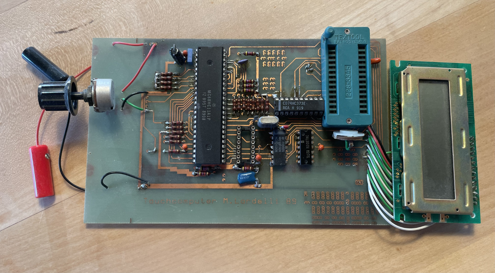

# Software to calculate decompression tables, diving simulation, hard- and software for a simple diving computer

## IMPORTANT: for educational purposes only!!

All the content in this repository was written by a 18-19 years old teenager **without any formal training in physics, diving medicine, electronics and software engineering**!!

Furthermore, all content is based on the state of the art of diving medicine around 1988!

**DO NOT USE THE CODE IN THIS REPOSITORY TO BUILD ANYTHING YOU INTEND TO USE FOR ACTUAL DIVING!!!**

Program files are written in GFA-Basic for the ATARI ST (they still run well in a simulator)

